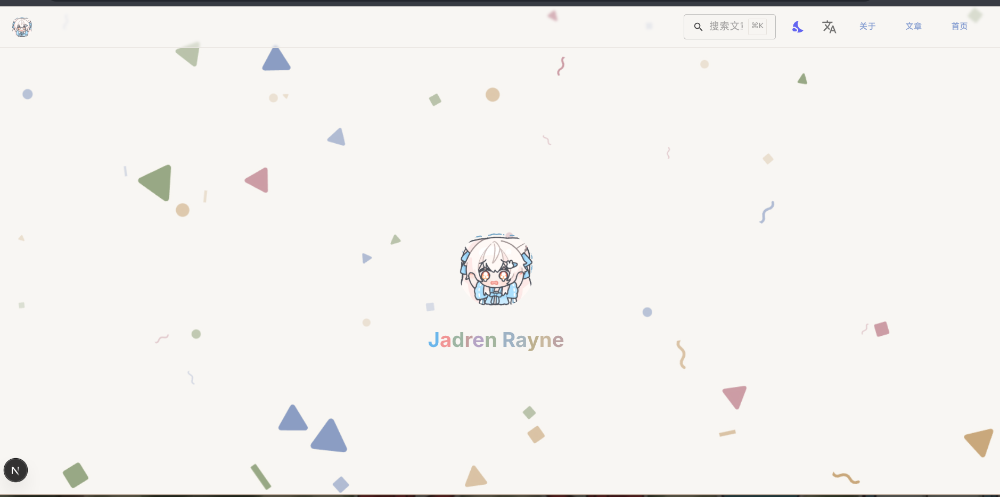
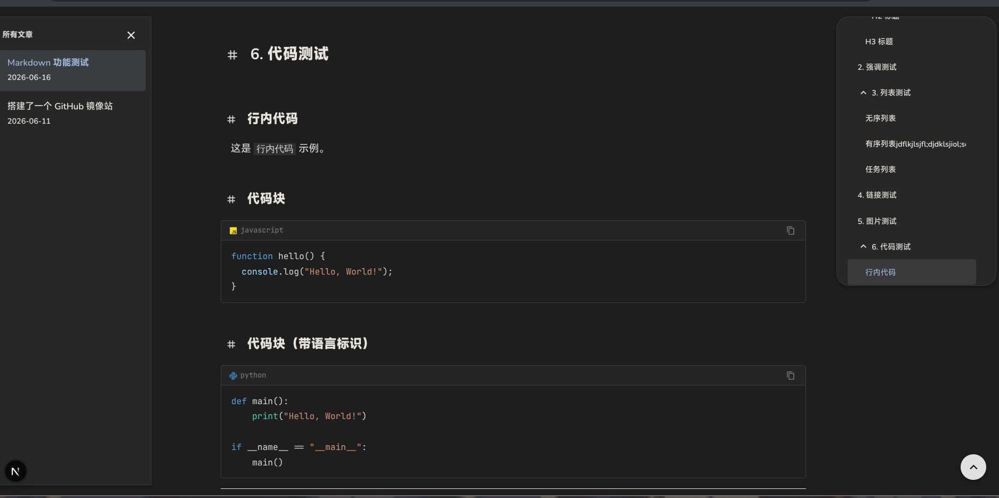
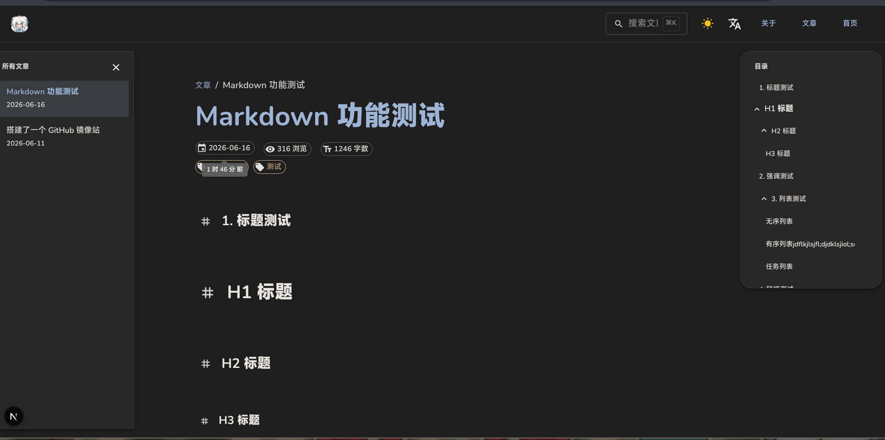

> 📖 [English README](../README.md)

## 这是一个自己闲暇编写的一个博客/简单文档站点
### 如果想查看该项目的效果, 请访问:
- [rayou's blog(https://blog.rayou.me)](https://blog.rayou.me)


## 关于提交文章或者更改文章
请按如下格式更改或创建并提交到 **master** 分支

### 文章格式

在 `content/posts/zh/`（中文）或 `content/posts/en/`（英文）目录下创建 `.md` 文件，文件顶部需要包含如下 frontmatter：

```markdown
---
title: 你的文章标题
date: 2026-06-16T00:00:00.000Z
description: 文章简介，留空会自动把标题变成描述
tags: [tag1, tag2]
---

在这里书写你的文章正文（Markdown 格式）...
```

- `title` — 文章标题
- `date` — 发布日期（ISO 格式），如果留空，会把第一次被访问的日期变更为文章日期
- `description` — 文章简介（可选），留空会自动把标题变成描述
- `tags` — 文章标签（可选）

之后会合并到 run 分支并部署到服务器上

## 关于使用此项目作为自己的博客或者文档站点
### 效果预览







### Step1:克隆项目 安装依赖 测试运行
> 由于本项目使用了bun独有的组件 bun:sqlite 所以你只能用bun(一个追求性能的nodejs解释器兼包管理器)来运行该项目,为了以防万一不能使用,推荐在使用bun时添加 --bun 参数,以下实例都使用了 --bun 参数

```shell
# 克隆该项目
git clone https://github.com/jadrens/dra_blog.git
```

> 如果国内服务器不方便连接github可以尝试使用我搭建的镜像站(github.rayou.me **为保护你的账号安全,切勿登录**) 详情请见 [搭建了一个Github镜像站](https://blog.rayou.me/blog/zh/github-mirror) <br>
> 此时使用 ```git clone https://github.rayou.me/jadrens/dra_blog.git```


```shell
# 确保你安装了bun
# 切换目录并安装依赖
cd dra_blog
bun install
```
```shell
# 测试运行
bun --bun dev
```
打开 **http://localhost:3000** 进行测试


## Step 2:修改配置
- 修改本项目的 ```/src/var/config.ts```
```typescript
export const SITE_CONFIG = {
  // 你的网站域名 这里用来生成sitemap.xml,有助于搜索引擎对你网站的索引
  baseUrl: "https://blog.rayou.me",
  // 网站标题
  siteName: "rayoumeu blog",
  // 给搜索引擎看的网站介绍
  description: "A blog with markdown and LaTeX support",
  // 如果你要把你的网站开源可编辑, 这里填入你的github项目地址
  githubRepo: "https://github.com/jadrens/drablog",
  githubBranch: "master",
  // 是否在网站底部显示你的github图标
  githubClipEnabled: true,
  // 是否开启github编辑按钮
  githubEditEnabled: true,
} as const;
```
- 修改图标
修改本项目的```/public/avatar.png```这就是网站的首页头像<br>
修改```/src/app/icon.png```这是网站的小图标(favicon.ico)

- 修改联系方式
修改 ```/src/var/contact.ts``` 选择启用哪些联系方式，并修改 url

```typescript
export const CONTACT_CONFIG = {
  github: {
    enabled: true,                              // 是否启用
    url: "https://github.com/jadrens",          // 你的 GitHub 主页
    username: "jadrens",
    color: "#181717",
  },
  youtube: {
    enabled: true,
    url: "https://www.youtube.com/@LoongRens",
    username: "@LoongRens",
    color: "#FF0000",
  },
  bilibili: {
    enabled: true,
    url: "https://space.bilibili.com/435996008",
    username: "dragonren",
    color: "#00A1D6",
  },
  telegram: {
    enabled: true,
    url: "https://t.me/dragonrens",
    username: "@dragonrens",
    color: "#26A5E4",
  },
  email: {
    enabled: true,
    address: "jaden@jadren.moe",
  },
  ...
} as const;
```

将 `enabled` 设为 `false` 即可隐藏对应的联系方式。

- 添加你的页面
-- 个人简介
修改 ```/content/about/zh.md``` 和 ```/content/about/en.md```（分别是中英文）
-- 文章
参见上述格式在 ```/content/posts/zh/...```（中文）和 ```/content/posts/en/...```（英文）添加 markdown 格式的文章，如果日期留空，会把第一次被访问的日期变更为文章日期，描述留空会自动把标题变成描述

## Step 3:部署


```shell
# 构建
bun --bun run build
# 运行
bun --bun run start -p 3000
```
- 该应用默认运行在3000端口,或者修改```-p```来更改,不支持tls,请用nginx等反向代理工具代理。可参考即用型配置 [`docs/nginx-example.conf`](nginx-example.conf)。

### 可选：使用 systemd 管理服务

```ini
# /etc/systemd/system/blog.service
[Unit]
Description=Blog Service
After=network.target

[Service]
Type=simple
User=your-user
WorkingDirectory=/path/to/dra_blog
ExecStart=/usr/bin/bun --bun run start -p 3000
Restart=on-failure

[Install]
WantedBy=multi-user.target
```

```shell
# 启用服务
sudo systemctl enable --now blog.service
```


## 关于 robots.txt 和 sitemap.xml

### robots.txt

默认允许所有爬虫，可以修改 `/src/app/robots.ts` 的 `rules` 来更改：

```typescript
// /src/app/robots.ts
import { MetadataRoute } from "next";
import { SITE_CONFIG } from "@/var/config";

export default function robots(): MetadataRoute.Robots {
  return {
    rules: {
      userAgent: "*",     // 允许所有爬虫
      allow: "/",          // 允许所有路径
      // disallow: "/admin/",  // 禁止某些路径
    },
    sitemap: `${SITE_CONFIG.baseUrl}/sitemap.xml`,
  };
}
```

### sitemap.xml

默认根据 `/src/var/config.ts` 中的 `SITE_CONFIG` 索引所有页面，包括：

- **主页** — `baseUrl`
- **关于页面** — `baseUrl/about`
- **博客列表** — `baseUrl/blog/{locale}`
- **博客文章** — `baseUrl/blog/{locale}/{slug}`

如需修改 sitemap 生成逻辑，编辑 `/src/app/sitemap.ts`：

```typescript
// /src/app/sitemap.ts
import { MetadataRoute } from "next";
import { getAllPosts, Locale } from "@/lib/posts";
import { SITE_CONFIG } from "@/var/config";

const locales: Locale[] = ["en", "zh"];

export default function sitemap(): MetadataRoute.Sitemap {
  const allPages: MetadataRoute.Sitemap = [
    {
      url: SITE_CONFIG.baseUrl,
      lastModified: new Date().toISOString().split("T")[0],
      changeFrequency: "weekly",
      priority: 1,
    },
    // ... 关于页面、博客列表、博客文章
  ];
  return allPages;
}
```

## 开源许可证

```
MIT License

Copyright (c) 2026 Jadrens

Permission is hereby granted, free of charge, to any person obtaining a copy
of this software and associated documentation files (the "Software"), to deal
in the Software without restriction, including without limitation the rights
to use, copy, modify, merge, publish, distribute, sublicense, and/or sell
copies of the Software, and to permit persons to whom the Software is
furnished to do so, subject to the following conditions:

The above copyright notice and this permission notice shall be included in all
copies or substantial portions of the Software.

THE SOFTWARE IS PROVIDED "AS IS", WITHOUT WARRANTY OF ANY KIND, EXPRESS OR
IMPLIED, INCLUDING BUT NOT LIMITED TO THE WARRANTIES OF MERCHANTABILITY,
FITNESS FOR A PARTICULAR PURPOSE AND NONINFRINGEMENT. IN NO EVENT SHALL THE
AUTHORS OR COPYRIGHT HOLDERS BE LIABLE FOR ANY CLAIM, DAMAGES OR OTHER
LIABILITY, WHETHER IN AN ACTION OF CONTRACT, TORT OR OTHERWISE, ARISING FROM,
OUT OF OR IN CONNECTION WITH THE SOFTWARE OR THE USE OR OTHER DEALINGS IN THE
SOFTWARE.
```